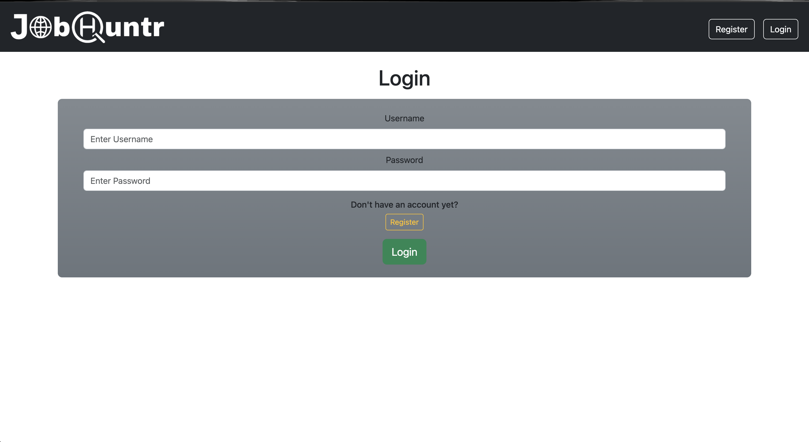
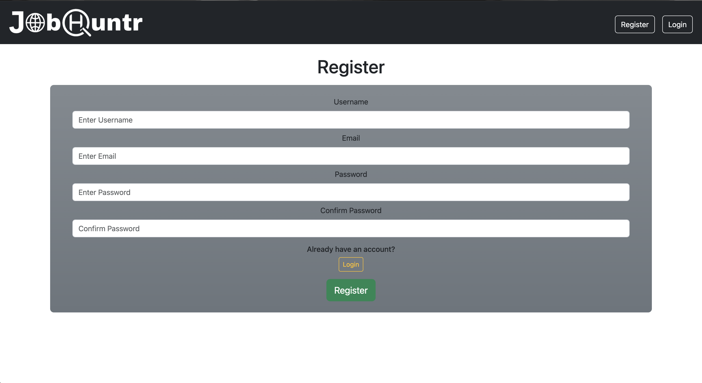
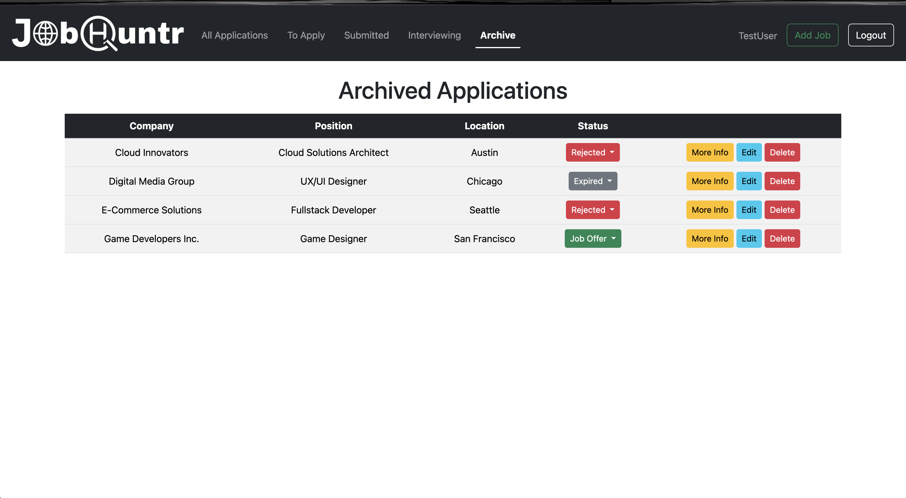
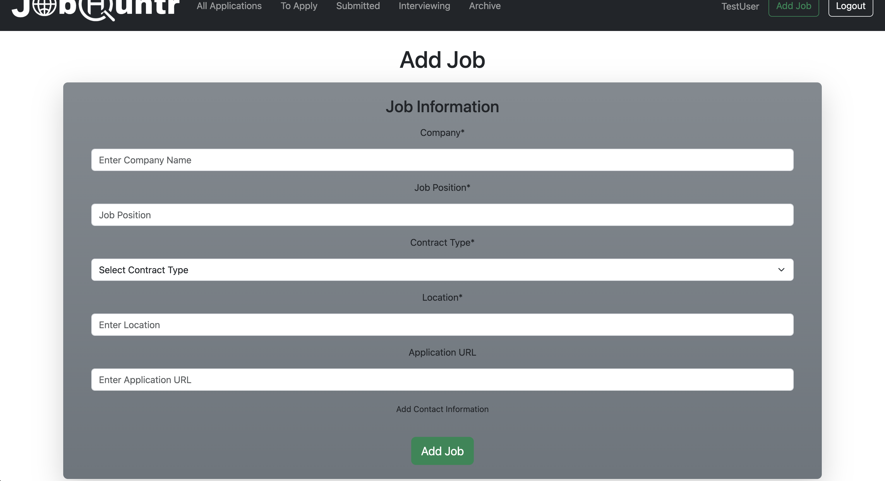
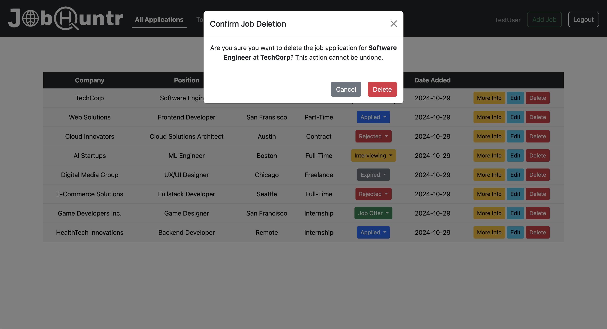
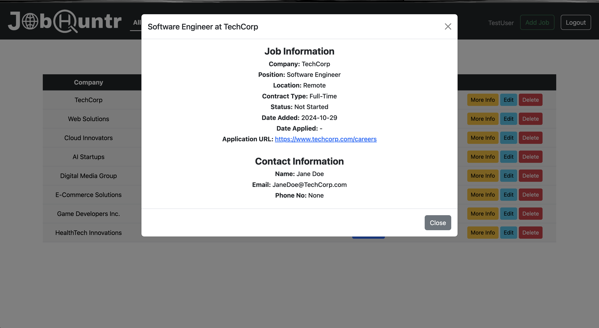

# JobHuntr (Job Application Tracker)

## Table of Contents
- [Overview](#overview)
- [Features](#features)
- [Video Demo](#video-demo)
- [Screenshots](#screenshots)
- [Getting Started](#getting-started)
  - [Prerequisites](#prerequisites)
  - [Installation and Running the Application](#installation-and-running-the-application)
  - [Closing the Application](#closing-the-application)
- [Dependencies](#dependencies)
- [Usage](#usage)
- [Note](#note)
- [Technology Stack](#technology-stack)
- [Contributions](#contributions)

## Overview
JobHuntr is a web application built with Flask, Python, Bootstrap, and SQLite, designed to help users manage their job applications efficiently. The application allows users to track jobs they want to apply for, monitor their application statuses, and organize their job search effectively.

## Features
- **User Authentication**: Users can register for an account, log in, and manage their profile.
- **Job Management**:
  - **Add Job**: Users can add jobs they want to apply for, along with optional contact information.
  - **Overview Page**: Displays all added jobs in a table format.
  - **Filtered Views**: Users can navigate through different views:
    - **To Apply**: Jobs the user has added but not applied for yet.
    - **Submitted**: Jobs the user has applied for but hasn't received a response for yet.
    - **Interviewing**: Jobs for which the user is interviewing or has interviewed but is waiting for a response.
    - **Archived**: Jobs that have expired, been rejected, or resulted in a job offer.
- **Job Status Management**: Easily change the status of jobs using a toggle menu.
- **Job Options**: Each job has buttons for "More Info," "Edit," and "Delete."
  - **More Info**: Opens a modal displaying full job information.
  - **Edit**: Redirects to a page for updating job details.
  - **Delete**: Opens a confirmation modal for deleting a job.

## Video Demo
A short video of the use of the application can be viewed at [https://youtu.be/y0auaZOhsko?si=Syl_jbEQXfBGR-Hs](https://youtu.be/y0auaZOhsko?si=Syl_jbEQXfBGR-Hs)

## Screenshots
### Login Page


### Registration Page
 

### Archived Page


### Add Job Page


### Delete Modal


### More Info


## Getting Started
### Prerequisites
Before you begin, ensure you have met the following requirements:
- **Python**: 
  - For Windows: Download and install Python 3.x from [python.org](https://www.python.org/downloads/).
  - For macOS: Check if Python 3.x is installed. You can install it via Homebrew:
    ```bash
    brew install python
    ```
  - After installation, verify by running:
    ```bash
    python --version
    ```

### Installation and Running the Application
1. Clone the repository:
   ```bash
   git clone [GitHub repository](https://github.com/ba2534so-s/job-application-tracker).
   cd job-application-tracker
   ```

   If you prefer not to use Git, you can download the project as a ZIP file:
   1. Go to the [GitHub repository](https://github.com/ba2534so-s/job-application-tracker).
   2. Click on the green "Code" button.
   3. Select "Download ZIP."
   4. Extract the downloaded ZIP file to access the project files.

2. To start the application, navigate to the project directory in your terminal and run the following command:
   ```bash
   ./setup.sh
   ```

    If the browser doesn’t open automatically, go to your web browser and navigate to [http://127.0.0.1:5000](http://127.0.0.1:5000).

### Closing the Application
To stop the application, you can either:
- Press Ctrl + C in the terminal where the application is running.
- Close the terminal window.


## Dependencies
All required dependencies are listed in the requirements.txt file. The setup script will automatically install these.

## Usage
- Users are directed to the login page.
- New users can click the “Register” button to create an account.
- After logging in, users have access to additional navigation options for managing their job applications.

## Note
Deleting the project folder will remove all associated files, including the virtual environment and database. Ensure you have backups if necessary.

## Technology Stack
### Backend
- Python
- Flask
### Frontend
- Bootstrap
- HTML 
- CSS
### Database
- SQLite

## Contributions
Contributions are welcome! Please feel free to submit issues or pull requests.